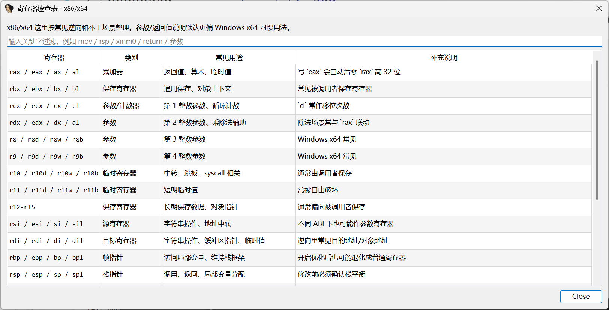
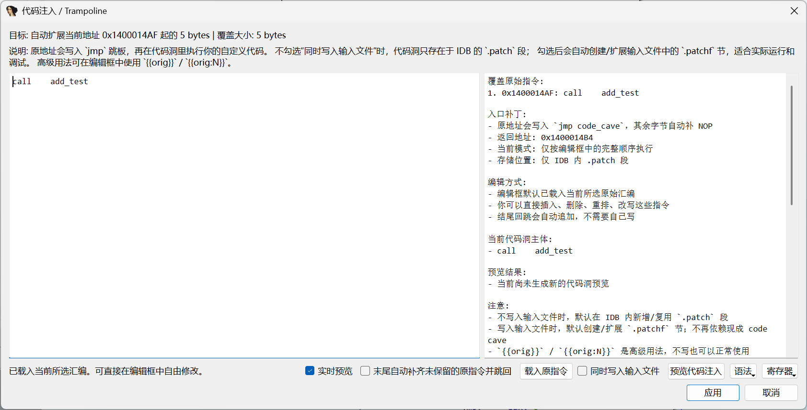
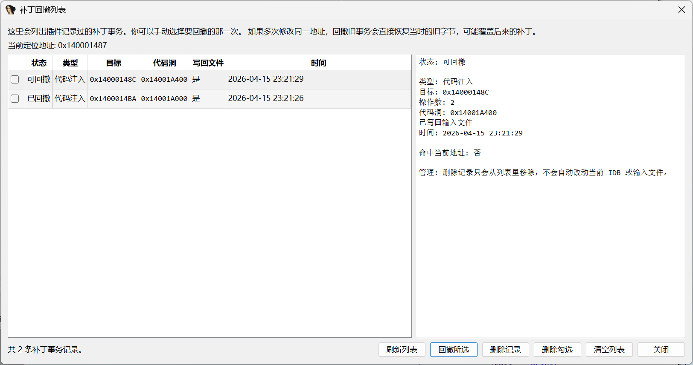
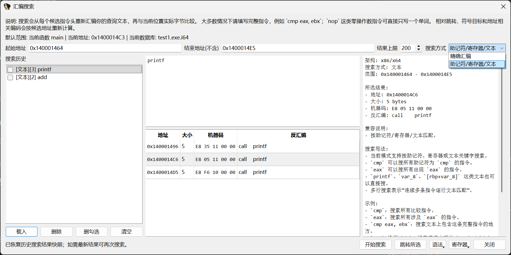
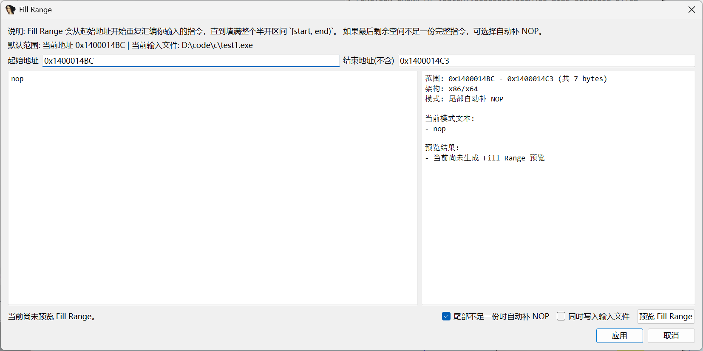

# ida_patch_pro
目前只测试了9.2pro版本

`ida_patch_pro` 是一个给 IDA Pro 使用的汇编补丁插件。它会在反汇编窗口的右键菜单里增加 `修改汇编`、`代码注入`、`NOP`、`Fill Range`、`汇编搜索` 和 `补丁回撤列表` 等功能，并提供更适合实际补丁工作的增强界面。

插件当前主要解决这几类问题：

- 直接在右键菜单里修改当前指令或选中范围
- 直接在右键菜单里做 trampoline / code cave 注入
- 直接在当前范围里重复填充某段汇编，或按汇编模式搜索全段/选区
- 对插件自己写入过的补丁做事务级回撤，并可从列表中手动选择
- 预览修改后的机器码和长度变化
- 对多行汇编一起修改
- 自动识别并提示常见助记符、寄存器用途、模板建议
- 自动处理 IDA 展示用的栈变量表达式
- 在 x86/x64 下对 IDA 自带 assembler 不稳定的场景提供 Keystone 兼容汇编兜底

## 功能

- 右键菜单新增 `修改汇编`
- 右键菜单新增 `代码注入`
- 右键菜单新增 `NOP`
- 右键菜单新增 `Fill Range`
- 右键菜单新增 `汇编搜索`
- 右键菜单新增 `补丁回撤列表`
- 右键菜单新增 `快捷键设置`
- 支持当前指令和选中范围补丁
- 支持多行汇编编辑
- 支持手动和实时机器码预览
- 支持语法速查窗口
- 支持寄存器速查表
- 支持寄存器作用提示
- 支持常见指令模板建议
- 支持长度超出时提示将覆盖到哪里
- 支持普通汇编在单条指令场景下自动扩到完整指令边界，并用 NOP 补齐剩余字节
- 支持自动补 NOP
- 支持 IDA 符号参与汇编，包括普通立即数、`[symbol]` 内存操作数、`call/jmp symbol`、`lea reg, symbol`
- 支持对 `mov [rsp+198h+var_158], 1` 这类写法做栈变量偏移折算
- 支持按汇编模式搜索当前范围内的字节匹配位置
- 支持汇编搜索历史，并可保存结果快照后直接恢复上次结果列表
- 支持在汇编搜索窗口批量勾选删除历史记录
- 支持在汇编搜索窗口右侧直接查看“完整指令写法”说明和搜索例子
- 支持在汇编搜索窗口顶部直接打开语法手册和寄存器手册
- 支持 Fill Range，重复汇编当前输入并填满指定范围
- 支持 CE 风格 trampoline 编辑
- 支持代码注入窗口实时机器码预览，并展示代码洞逐行机器码
- 支持代码注入窗口展示 `{{orig}}` / `{{orig:N}}` 的实际用法例子
- 支持在代码注入窗口顶部直接打开语法手册和寄存器手册
- 支持把补丁同步写回输入文件
- 支持 PE / DLL / PYD 在写回输入文件时自动创建或扩展 `.patchf`
- 支持 ELF / SO 在写回输入文件时自动扩展最后一个 `PT_LOAD` 来承载 `.patchf`
- 支持 ELF / SO 以“追加到文件尾 + 扩展最后一个 `PT_LOAD`”的方式写回 `.patchf`，避免因中间插入数据破坏 ELF 结构
- 支持在 trampoline 里对 `call/jmp symbol` 优先解析到可执行代码入口（如 `.plt` / 跳板函数），避免误跳到 GOT / 数据符号导致运行时崩溃
- 支持导出/导入补丁包
- 支持补丁包记录输入文件导出前后的 SHA256，并在导入时校验“当前文件是否等于原始状态或目标状态”
- 支持代码注入类补丁包在导入时优先按原始注入参数重放，而不是仅按结果字节硬写
- 支持按列表选择任意一条插件补丁事务回撤
- 支持在补丁回撤列表中批量勾选删除历史记录
- 支持给插件动作设置并保存自定义快捷键
- 支持普通汇编在超长时提示“继续覆盖 / 改用代码注入”，并记住策略

## 截图

### 1. 右键菜单


### 2. Assemble 主界面


### 3. 语法帮助窗口


### 4. 寄存器速查表



### 5.代码注入



### 6.回撤列表


### 7.汇编搜索


### 8.fill range



## 项目结构

- [ida_patch_pro.py](./ida_patch_pro.py)：IDA 插件入口壳文件。IDA 通过它发现插件，再转发到包目录。
- [ida_patch_pro_pkg](./ida_patch_pro_pkg)：插件主目录。实际逻辑已经按 `plugin / actions / ui / asm / patching / trampoline / backends` 拆开。
- [ida_patch_pro_pkg/plugin.py](./ida_patch_pro_pkg/plugin.py)：`PLUGIN_ENTRY`、`plugin_t` 生命周期、插件加载/卸载入口。
- [ida_patch_pro_pkg/actions.py](./ida_patch_pro_pkg/actions.py)：右键菜单、顶部菜单、action handler、动作注册。
- [ida_patch_pro_pkg/ui](./ida_patch_pro_pkg/ui)：各个非模态窗口，分别负责普通汇编修改、代码注入、Fill Range、汇编搜索、回撤列表、快捷键设置和参考表。
- [ida_patch_pro_pkg/asm](./ida_patch_pro_pkg/asm)：汇编文本解析、符号兼容改写、Keystone 兜底、汇编搜索、右侧提示和模板建议。
- [ida_patch_pro_pkg/patching](./ida_patch_pro_pkg/patching)：选区获取、范围规划、普通补丁写入、Fill Range、事务记录、历史保存、补丁回撤。
- [ida_patch_pro_pkg/trampoline](./ida_patch_pro_pkg/trampoline)：代码洞分配、trampoline 规划、风险提示、函数尾块挂接，以及代码注入应用主链。
- [ida_patch_pro_pkg/backends](./ida_patch_pro_pkg/backends)：输入文件写回、PE `.patchf` 节管理、EA 与文件偏移映射。
- [ida_patch_pro_pkg/runtime](./ida_patch_pro_pkg/runtime)：运行时日志、历史、设置文件路径。
- [ida_patch_pro_pkg/core.py](./ida_patch_pro_pkg/core.py)：兼容薄壳。现在只保留对旧入口的兼容，不再承载主要逻辑。
- [ida_patch_pro_pkg/data.py](./ida_patch_pro_pkg/data.py)：静态提示数据。包含助记符说明、寄存器说明、语法速查表、寄存器速查表。
- [ida_patch_pro_pkg/README.md](./ida_patch_pro_pkg/README.md)：包内模块职责说明，包含各文件关键函数和维护边界。
- `docs/images/`：README 截图目录。

### 推荐阅读顺序

如果后续要继续改功能，建议按下面顺序读：

1. [ida_patch_pro.py](./ida_patch_pro.py)
   确认 IDA 实际如何发现并转发到包目录。
2. [ida_patch_pro_pkg/plugin.py](./ida_patch_pro_pkg/plugin.py)
   看插件生命周期，确认 `init/run/term` 和实际入口。
3. [ida_patch_pro_pkg/actions.py](./ida_patch_pro_pkg/actions.py)
   看动作注册、右键菜单、顶部菜单和窗口打开路径。
4. [ida_patch_pro_pkg/ui/assemble_dialog.py](./ida_patch_pro_pkg/ui/assemble_dialog.py) / [ida_patch_pro_pkg/ui/trampoline_dialog.py](./ida_patch_pro_pkg/ui/trampoline_dialog.py)
   看用户实际操作流程，理解普通汇编修改和代码注入两条主路径。
5. [ida_patch_pro_pkg/asm](./ida_patch_pro_pkg/asm) + [ida_patch_pro_pkg/patching](./ida_patch_pro_pkg/patching)
   看汇编兼容改写、补丁写入、事务记录、回撤。
6. [ida_patch_pro_pkg/trampoline](./ida_patch_pro_pkg/trampoline) + [ida_patch_pro_pkg/backends](./ida_patch_pro_pkg/backends)
   只在你要继续改 code cave、`.patch` / `.patchf`、文件写回时再深入。
7. [ida_patch_pro_pkg/data.py](./ida_patch_pro_pkg/data.py)
   只在你要改右侧提示、语法帮助、寄存器帮助时再看。

更细的文件职责和关键函数见 [ida_patch_pro_pkg/README.md](./ida_patch_pro_pkg/README.md)。

### 运行时生成文件

- `plugins\ida_patch_pro_pkg\ida_patch_pro.test.log`：本地测试日志，定位汇编失败、文件写回、trampoline 分配、异常堆栈。
- `plugins\ida_patch_pro_pkg\ida_patch_pro.history.json`：插件补丁历史。`补丁回撤列表` 依赖它来恢复之前写入的字节。
- `plugins\ida_patch_pro_pkg\ida_patch_pro.settings.json`：插件本地设置。当前用于保存动作快捷键、普通汇编超长时的默认处理策略，以及汇编搜索历史和结果快照。

## 安装方法


1. 把下面两个对象一起复制到 IDA 的 `plugins` 目录：
   - [ida_patch_pro.py](./ida_patch_pro.py)
   - 整个 [ida_patch_pro_pkg](./ida_patch_pro_pkg) 文件夹
2. 重启 IDA。
3. 在反汇编窗口右键，即可看到 `修改汇编`、`代码注入`、`NOP`、`Fill Range`、`汇编搜索`、`补丁回撤列表` 和 `快捷键设置`。

典型路径示例：

```text
D:\TOOL\ida_9.2\plugins\ida_patch_pro.py
```


## 使用方法

### 修改汇编

1. 在 IDA 反汇编窗口选中一条或多条指令。
2. 右键点击 `修改汇编`。
3. 在弹出的 `Assemble` 窗口中修改汇编文本。
4. 可以直接看实时机器码预览，也可以手动点击 `预览机器码`。
5. 如果新汇编超过原范围，可按顶部 `超长时` 策略决定是每次询问、直接继续覆盖，还是直接改用代码注入。
6. 点击 `应用` 写入补丁。

### NOP

1. 在反汇编窗口选中一条或多条指令。
2. 右键点击 `NOP`。
3. 插件会将当前指令或选中范围自动填充为 `NOP`。

### 代码注入

1. 在反汇编窗口选中一条或多条要被 trampoline 覆盖的指令。
2. 右键点击 `代码注入`。
3. 编辑框会默认载入当前所选汇编，你可以直接改、删、插、重排。
4. 顶部 `实时预览` 会在输入停顿后自动刷新入口跳板、代码洞和逐行机器码。
5. 需要真实运行/调试时，勾选 `同时写入输入文件`。
   - PE / DLL / PYD：会自动创建或扩展 `.patchf` 作为文件内代码洞。
   - ELF / SO：会自动把 `.patchf` 追加到文件尾，并扩展最后一个 `PT_LOAD` 覆盖这段代码，避免破坏现有 ELF 头/节表布局。
6. 顶部 `语法` / `寄存器` 按钮可直接打开手册，方便边写边查。
7. 高级用法可在编辑框中写 `{{orig}}` 或 `{{orig:N}}`，把被覆盖的原始指令插回指定位置。
8. 点击 `预览代码注入` 或 `应用`。

补充说明：

- x86/x64 的 `call/jmp symbol` 在代码洞里会优先解析到可执行代码入口；例如 ELF 下用户写 `call _printf` 时，会优先落到 `.printf` / `printf@plt` 这类可执行入口，而不是 GOT / 数据别名。
- 当前 ELF 写回路径已经实测打通“注入后实际运行”的场景；若旧样本曾被更早版本的 ELF 实验逻辑改坏，建议先恢复原始文件后再重新注入。
- 代码注入在真正应用时会先写 trampoline body，再校验 IDB / 输入文件里的 payload，最后才提交入口 `jmp` 对应事务；回撤记录也会同时包含 cave 和 entry 两部分。

### 导出/导入补丁包

1. 在反汇编窗口右键点击 `导出补丁包`，可把当前 active 补丁事务打包为 `.idppatch.json`。
2. 导出时会记录：
   - 补丁事务本身
   - 输入文件导出前的 `SHA256`
   - 输入文件导出后的 `SHA256`
3. 代码注入类事务还会额外记录原始注入参数，包括自定义汇编、`{{orig}}` 相关设置、覆盖范围、原始指令快照等 replay 信息。
4. 右键点击 `导入补丁包` 后，插件会先校验当前输入文件是否等于导出前原始状态，或已经等于导出时目标状态。
5. 对普通补丁，导入仍按事务和字节结果重放。
6. 对代码注入事务，导入会优先按原始注入参数重新执行一次代码注入主链，而不是只硬写入口 `jmp` / payload 结果字节。

补充说明：

- 这套“按原始注入参数重放”对新导出的补丁包效果最好；旧版本插件导出的历史包如果没有 replay 元数据，会自动回退到兼容的字节级导入路径。
- 如果你刚修过代码注入或补丁包逻辑，建议重新导出一次新包再做导入测试。

### Fill Range

1. 在反汇编窗口选中一个范围，或手工输入起止地址。
2. 右键点击 `Fill Range`。
3. 输入要重复填充的汇编文本，例如 `nop`。
4. 点击 `预览 Fill Range` 查看重复次数、总写入大小和尾部 NOP 补齐情况。
5. 点击 `应用` 写入补丁。

### 汇编搜索

1. 在反汇编窗口右键点击 `汇编搜索`。
2. 选择搜索范围，默认优先使用当前选区，否则使用当前函数，再退回当前段。
3. 选择搜索方式：
   - `精确汇编`：适合 `cmp eax, ebx` 这类完整指令匹配。
   - `助记符/寄存器/文本`：适合直接搜 `cmp`、`eax`、`printf`。
4. 输入一条或多条搜索文本。`精确汇编` 模式下建议写完整指令；`nop`、`ret` 这类零操作数指令可直接只写一个单词。
5. 点击 `开始搜索`。
6. 搜索完成后，当前查询和结果快照会写入历史；下次点击历史项可直接恢复结果列表，不必重新搜索。
7. 历史列表支持单条删除、批量勾选删除和按当前数据库清空。
8. 顶部 `语法` / `寄存器` 按钮可直接打开手册。
9. 双击结果行可直接跳转到命中地址。

### 补丁回撤列表

1. 把光标停在你刚改过的地址附近，或选中对应区域。
2. 右键点击 `补丁回撤列表`。
3. 插件会列出已记录的补丁事务，你可以手动选择任意一条回撤。
4. 列表支持单条删除、批量勾选删除和清空历史。
5. 删除记录只会移除历史项，不会自动改动当前 IDB 或输入文件里的补丁。

### 快捷键设置

1. 在反汇编窗口右键点击 `快捷键设置`，或直接运行插件入口。
2. 为各动作输入你想要的快捷键，留空表示取消该动作快捷键。
3. 点击 `保存` 后，插件会保存到本地设置文件，并尽量立即更新当前 IDA 会话。

当前默认快捷键：

- `修改汇编`：`Ctrl+Alt+A`
- `代码注入`：`Ctrl+Alt+T`
- `NOP`：`Ctrl+Alt+N`
- `Fill Range`：`Ctrl+Alt+F`
- `汇编搜索`：`Ctrl+Alt+S`
- `补丁回撤列表`：`Ctrl+Alt+R`

## 界面说明

`Assemble` 窗口主要分成两部分：

- 左侧：汇编编辑区
- 右侧：上下文提示区

右侧提示区会展示：

- 原指令
- 原机器码
- 当前编辑内容
- 新机器码预览
- 兼容说明
- 指令说明
- 寄存器提示
- 模板建议

顶部 `实时预览` 可控制是否在停止输入片刻后自动刷新机器码预览。

顶部 `语法` 按钮可打开当前架构的常见汇编语法帮助表。

顶部 `寄存器` 按钮可打开当前架构的寄存器速查表，并支持关键字过滤。

## 兼容性

- 已针对 IDA Pro 9.2 使用场景调整
- UI 依赖 IDA 自带的 PySide6
- x86/x64 下支持 Keystone 兼容汇编兜底

如果 IDA 自带 assembler 无法处理某些简单改写，插件会自动尝试更稳的兼容路径。

## 常见场景

### 1. 改寄存器赋值

```asm
mov rdi, rbp
```

可以改成：

```asm
mov edi, 1
```

或：

```asm
xor edi, edi
```

### 2. 改栈变量写入

原始显示可能是：

```asm
mov     [rsp+198h+var_158], eax
```

编辑时可以直接输入：

```asm
mov dword ptr [rsp+198h+var_158], 1
```

插件会自动把 IDA 展示用的栈变量表达式折算成真实可汇编偏移再尝试汇编。

### 3. 覆盖多条指令

如果新机器码长度大于当前单条指令长度，插件会提示你是否按完整指令边界继续扩展覆盖，并在需要时自动补 NOP。

## 注意事项

- 修改汇编前建议先备份数据库
- 新机器码长度变长时，可能覆盖后续指令
- 某些向量指令不能直接写立即数，右侧模板建议会给出替代写法
- 如果你修改的是选中范围，写入长度不能超过该选区
