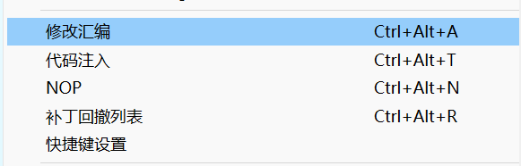
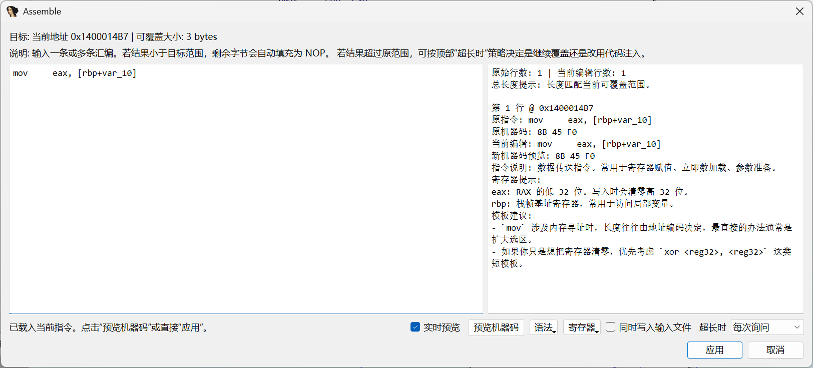
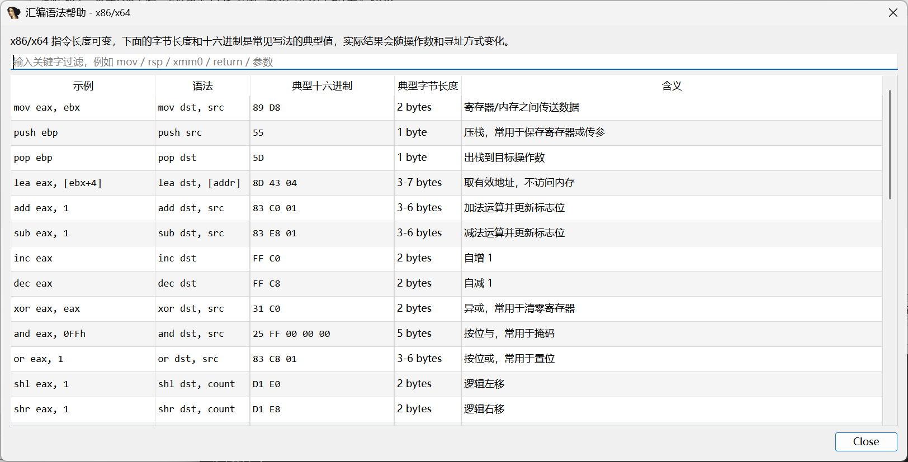

# IDA-patch-pro

`IDA-patch-pro` 是一个给 IDA Pro 使用的汇编补丁插件。它会在反汇编窗口的右键菜单里增加 `修改汇编` 和 `NOP` 两个功能，并提供更适合实际补丁工作的增强界面。

插件当前主要解决这几类问题：

- 直接在右键菜单里修改当前指令或选中范围
- 预览修改后的机器码和长度变化
- 对多行汇编一起修改
- 自动识别并提示常见助记符、寄存器用途、模板建议
- 自动处理 IDA 展示用的栈变量表达式
- 在 x86/x64 下对 IDA 自带 assembler 不稳定的场景提供 Keystone 兼容汇编兜底

## 功能

- 右键菜单新增 `修改汇编`
- 右键菜单新增 `NOP`
- 支持当前指令和选中范围补丁
- 支持多行汇编编辑
- 支持机器码预览
- 支持语法速查窗口
- 支持寄存器作用提示
- 支持常见指令模板建议
- 支持长度超出时提示将覆盖到哪里
- 支持自动补 NOP
- 支持对 `mov [rsp+198h+var_158], 1` 这类写法做栈变量偏移折算

## 截图

这里预留了几个截图位置，你把图片放进 `docs/images/` 后直接替换文件即可。

### 1. 右键菜单



建议文件名：`context-menu.png`

### 2. Assemble 主界面



建议文件名：`assemble-dialog.png`

### 3. 语法帮助窗口



建议文件名：`syntax-help.png`

### 4. 多行预览/模板建议


建议文件名：`multi-line-preview.png`

## 文件说明

- [asm_patch_popup.py](./asm_patch_popup.py)：IDA 插件主文件
- `docs/images/`：README 截图目录

## 安装方法

### 方式一：直接复制插件文件

1. 把 [asm_patch_popup.py](./asm_patch_popup.py) 复制到 IDA 的 `plugins` 目录。
2. 重启 IDA。
3. 在反汇编窗口右键，即可看到 `修改汇编` 和 `NOP`。

典型路径示例：

```text
D:\TOOL\ida_9.2\plugins\asm_patch_popup.py
```

### 方式二：从仓库开发调试

1. 克隆本仓库。
2. 修改 [asm_patch_popup.py](./asm_patch_popup.py)。
3. 将修改后的文件同步到 IDA 的 `plugins` 目录。
4. 重启 IDA 或重新加载插件。

## 使用方法

### 修改汇编

1. 在 IDA 反汇编窗口选中一条或多条指令。
2. 右键点击 `修改汇编`。
3. 在弹出的 `Assemble` 窗口中修改汇编文本。
4. 点击 `预览机器码` 查看结果。
5. 点击 `应用` 写入补丁。

### NOP

1. 在反汇编窗口选中一条或多条指令。
2. 右键点击 `NOP`。
3. 插件会将当前指令或选中范围自动填充为 `NOP`。

## 界面说明

`Assemble` 窗口主要分成两部分：

- 左侧：汇编编辑区
- 右侧：上下文提示区

右侧提示区会展示：

- 原指令
- 原机器码
- 当前编辑内容
- 新机器码预览
- 兼容说明
- 指令说明
- 寄存器提示
- 模板建议

顶部 `语法` 按钮可打开当前架构的常见汇编语法帮助表。

## 兼容性

- 已针对 IDA Pro 9.2 使用场景调整
- UI 依赖 IDA 自带的 PySide6
- x86/x64 下支持 Keystone 兼容汇编兜底

如果 IDA 自带 assembler 无法处理某些简单改写，插件会自动尝试更稳的兼容路径。

## 常见场景

### 1. 改寄存器赋值

```asm
mov rdi, rbp
```

可以改成：

```asm
mov edi, 1
```

或：

```asm
xor edi, edi
```

### 2. 改栈变量写入

原始显示可能是：

```asm
mov     [rsp+198h+var_158], eax
```

编辑时可以直接输入：

```asm
mov dword ptr [rsp+198h+var_158], 1
```

插件会自动把 IDA 展示用的栈变量表达式折算成真实可汇编偏移再尝试汇编。

### 3. 覆盖多条指令

如果新机器码长度大于当前单条指令长度，插件会提示你是否继续覆盖后续字节。

## 注意事项

- 修改汇编前建议先备份数据库
- 新机器码长度变长时，可能覆盖后续指令
- 某些向量指令不能直接写立即数，右侧模板建议会给出替代写法
- 如果你修改的是选中范围，写入长度不能超过该选区

## 开发说明

这个仓库当前保持单文件插件结构，方便直接放进 IDA 的 `plugins` 目录调试。

如果后续功能继续扩展，建议再拆分成：

- `asm_patch_popup.py`
- `syntax_tables.py`
- `hints.py`
- `fallback_assemblers.py`

## 许可证

目前仓库未附带单独许可证文件；如果准备公开分发，建议补一个 `LICENSE`。
